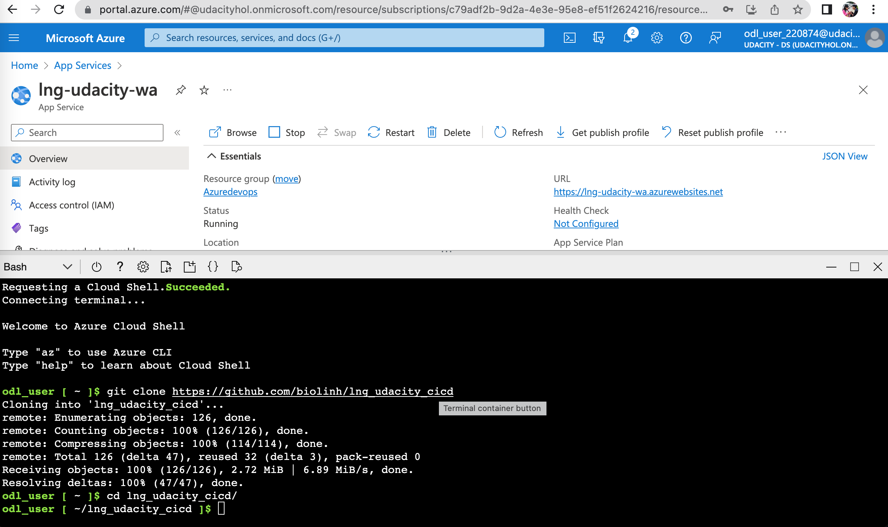
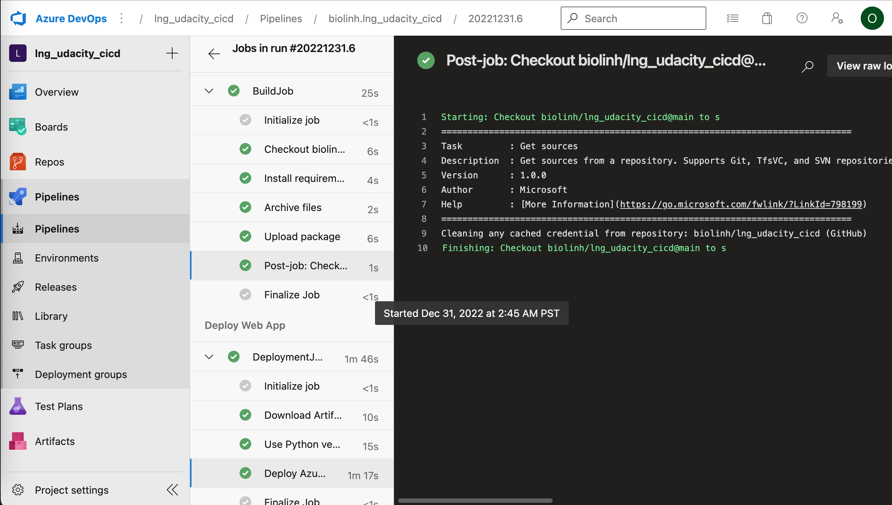

# lng_udacity_cicd

## Project Plan

* [Trello board](https://trello.com/invite/b/NsdK0YTv/ATTIce970d861f4218a475b74b0450b12c57704086A7/udacity-lng)
* [project-planning](https://docs.google.com/spreadsheets/d/1NNsDU3lvqBCZ4wzH8AcrHmcJzjq5UMug4e-Ou1pSrZ0/edit?usp=sharing)

## Instructions
 
* Architectural Diagram 


* Pre-requirement

```shell
python3 -m venv ~/.venv 
source ~/.venv/bin/activate
pip install -r flask-sklearn/requirements.txt
```

* Project running on Azure App Service

```bash
git clone https://github.com/biolinh/lng_udacity_cicd
```

* Project cloned into Azure Cloud Shell


```bash
az webapp up -n "lng-udacity-wa" --runtime "PYTHON:3.8"

```

* Passing tests that are displayed after running the `make all` command from the `Makefile`

```bash
make all

```
* Output of a test run
Testing result: After above step you see dependencies are installed, lint rate 9.69/10 and test with error:
```
 app.py:37:4: W0702: No exception type(s) specified (bare-except)

------------------------------------------------------------------
Your code has been rated at 9.69/10 (previous run: 9.69/10, +0.00)

make: *** [Makefile:15: lint] Error 4
```


* Successful deploy of the project in Azure Pipelines.  [Note the official documentation should be referred to and double checked as you setup CI/CD](https://docs.microsoft.com/en-us/azure/devops/pipelines/ecosystems/python-webapp?view=azure-devops).



* Running Azure App Service from Azure Pipelines automatic deployment


* Deploy flask app in Azure Cloud Shell.  [Use this file as a template for the deployed prediction](https://github.com/udacity/nd082-Azure-Cloud-DevOps-Starter-Code/blob/master/C2-AgileDevelopmentwithAzure/project/starter_files/flask-sklearn/make_predict_azure_app.sh).
The output should look similar to this:

```bash
udacity@Azure:~$ ./make_predict_azure_app.sh

```

* Output of streamed log files from deployed application

```bash
az webapp log tail -g ODL-clouddevops-220639 -n lng-udacity-wa
```


## Enhancements

- Should apply branch model. main/master branch for release. and orther branch for feature and dev environment. So that each environment we have a set of resources and its own pipeline. Developer just merge the code to target branch, pipieline will auto run

- Can apply IAC by using terraform file


## Demo 

[demo](https://youtu.be/fMST_wl5ttg)


